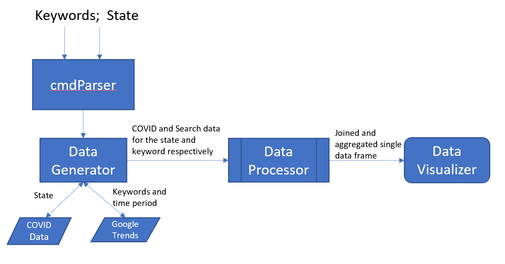

# Coronavirus Lifestyle Impacts

## Overview
This document describes the high-level architecture of the tool.

## Tenets (Unless you know better ones)
- easy to install
- easy to use
- meaningful visualization and insights
- parallel implementation
- privacy of user inputs: the tool does not collect or store any user input data

## Goal
- isolated components each with single responsibility
- extensibility: each component should be easy to extend by feature request
- easy to test by component

## Out of Scope
- availability: this command line tool depends on an [unofficial API](https://pypi.org/project/pytrends/) for Google trends. The availability
  of the API and Google trends directly impact the functionality of this tool
- long-running queries: depending on the user input, some queries will take longer to return due to data volume. The tool will have a time-out
  limit set for each query. User will be offered an option to provide custom time-out.

## Component Specification



The Project contains the following components:
1. CmdParser
2. DataGenerator
3. DataProcessor
4. DataVisualizer

### 1. CmdParser
This is the interface between the end-user and our service. The CommandLineParser will take the user command, validate the inputs, and pass it
down to the downstream services. It is a lightweight and should always return a response to the end user.
There are two public Python command line parsers to use: [ArgParser](https://docs.python.org/3/library/argparse.html) and [Click])https://click.palletsprojects.com/en/7.x/). Click is preferred but the decision has not been made yet.

For example:
- user input: `$: covid19-impacts --country USA --state WA --time-period 1month --coivd19 ['deaths'] --trend ['masks', 'hand sanitizer']`
- outputs: all user input data returned in a json string
```
{
  "user": "<UUID>",
  "country": "USA",
  "state": "WA",
  "start_time": "<timestamp>",
  "end_time": "<timestamp>",
  "covid19": ["deaths"],
  "trend": ["masks", "hand sanitizer"]
}
```

Detailed list of commands and whether it's required or optional is pending design.

###  2. DataGenerator
A DataGenerator is responsible of taking the input Json blob and providing datasets in Pandas DataFrame format.
The DataGenerator is designed to have two sub-components: a `query_builder.py` module and a `query_executor.py`.
- Input: Time period and source data set links to be provided for the module.
- Output: Data specific to corona virus infections, fatalities by state and Search and Twitter trends with various filters.

### 3. DataProcessor:
A DataProcessor is responsible of taking the provided data frame, validating the results, and performing aggregation and filtering. The output
is a structured Pandas DataFrame which can be used by the DataVisualizer.
- Input: Data provided by DataGenerator.
- Output: A filtered and aggregated data frame.

### 4. DataVisualizer
A DataVisualizer is responsible of rendering the final graphs for end-user by taking the input data from DataProcessor.
- Input: Aggregated data from DataProcessor.
- Output: Graphs to end user.

## Test
For each component, we will have a validator to unit test its functionality. We will also have a simple end-to-end integration test. The
integration test will be part of the GitHub build process and shown as the build badge at the front page of the repo.

## Sample DataFlow and UseCase
1. User will input the time period and the lifestyle trend they would like to observe the shifts. These lifestyle trends are going to be pre-selected.
2. User also gets to choose if they want to look at a specific state or for the country (USA).
3. Once they get the visualization they can, make changes to make the graphs interactive

## Work items and Owners
- Refine use case and build test input [team]
- Design review with team [team]
- Implementation in parallel and unit test
  - CmdParser []
  - DataGenerator []
  - DataProcessor []
  - DataVisualizer []
- CI/CD: End-to-end test and release pipeline []
- Presentation
